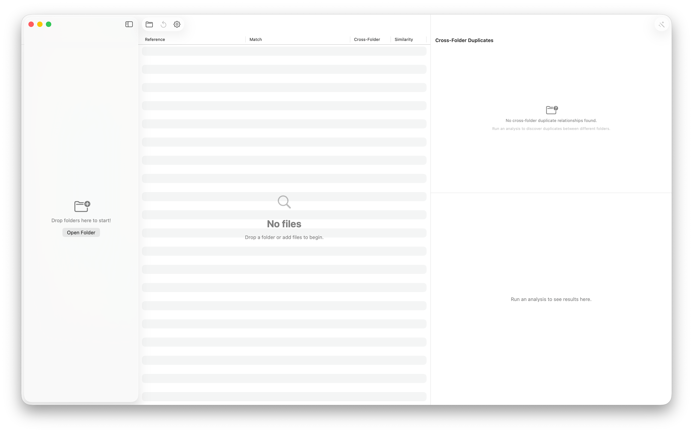
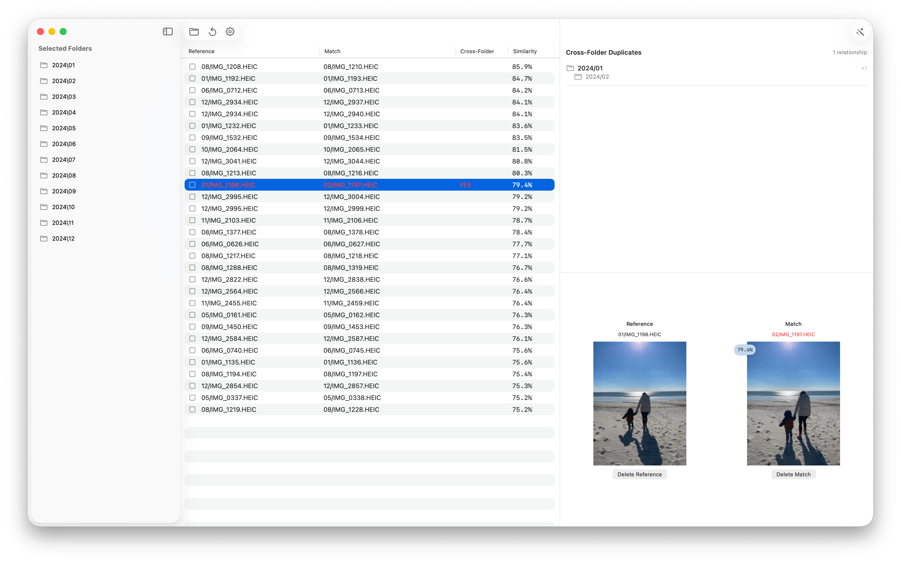

# Twinalyzer – Find Duplicate & Similar Photos

Twinalyzer is a SwiftUI app that scans your folders and groups **duplicate** and **look‑alike** photos—even when they’re resized, rotated, lightly edited, or named differently. It blends a **perceptual hash** for speed with **Apple Vision deep embeddings** for high‑quality similarity, then shows you crisp previews so you can keep only the best.

## 🖥️ Screenshots 

<p align="center">
    
    
</p>

## ✨ Highlights

- Adjustable similarity threshold slider 🎚️
- Apple Vision embeddings for deep similarity 🔬
- Dock badge & progress feedback 🧮
- Optional notifications for long runs 🔔
- Modern Swift Concurrency throughout 🧵
- Scan folders recursively and group near‑duplicates 📁
- Understands common formats (HEIC/JPG/PNG/WEBP) 🖼️
- QuickLook Support! Click a preview image to open in native macOS QuickLook. 

## 🧠 How it works (in plain English)

1. **Walk the folders** you choose and gather images.  
2. **Select Compute** for each run: a quick **Basic Scan** (good for exact matches) and a rich **Advanced Scan** (uses AI Vision to detect poses, structure, etc).  
3. **Compare images** using a unified, normalized similarity score (0–1).  
4. **Cluster items** into groups of exact duplicates and near‑duplicates.  
5. **Preview & act**—open the original in Finder, inspect pixel‑level differences, or bulk‑decide which to keep. Click images to open in QuickLook! 


## 🔍 Troubleshooting & Notes

- **False positives/negatives** → adjust the similarity slider. For highly edited variants, use a slightly **lower** threshold.
- **RAM** → If you're analyzing large data sets, make sure you have the RAM to handle it. It can easily use over 2GB of RAM. 

## 🖥️ Install & Minimum Requirements

- macOS 15.0 or later  
- Universal Binary (not tested on Intel!)
- ~20 MB free disk space
- ~3GB free RAM for large scans. 


### ⚙️ Installation

Download from Releases. It's signed & notarized!

### ⚙️ Build it yourself!

Clone the repo and build with Xcode:

```bash
git clone https://github.com/gbabichev/twinalyzer.git
cd twinalyzer
open twinalyzer.xcodeproj
```
