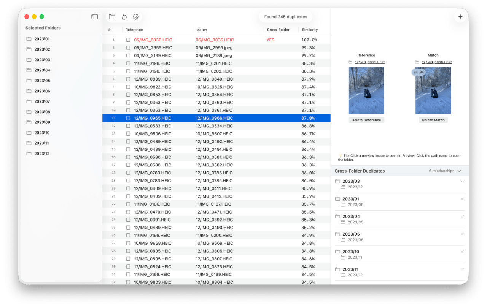
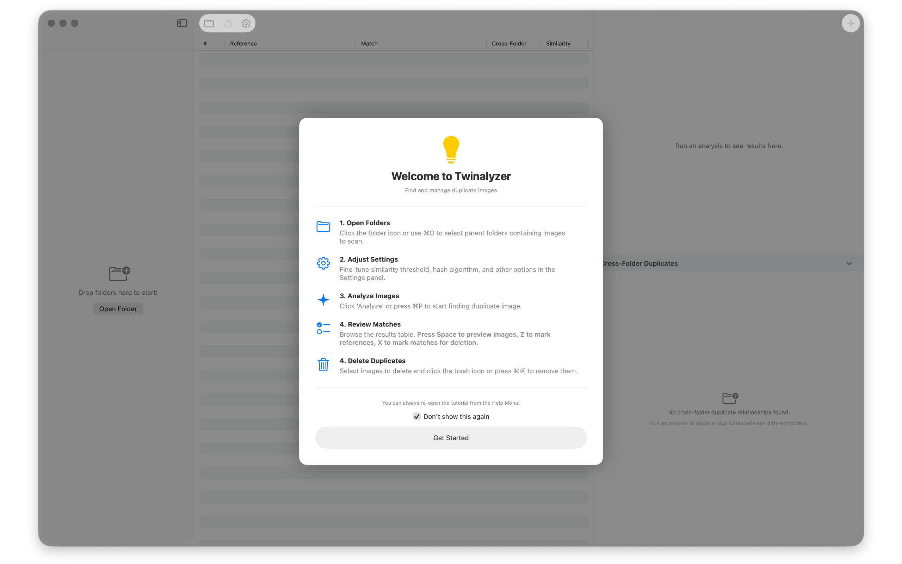

<div align="center">

<picture>
  <source srcset="Documentation/icon-dark.png" media="(prefers-color-scheme: dark)">
  <source srcset="Documentation/icon-light.png" media="(prefers-color-scheme: light)">
  
</picture>
<br/><br/>

Twinalyzer is a SwiftUI app that scans your folders and groups **duplicate** and **look‑alike** photos—even when they’re resized, rotated, lightly edited, or named differently. It blends a **perceptual hash** for speed with **Apple Vision deep embeddings** for high‑quality similarity, then shows you crisp previews so you can keep only the best.

</div>

## 🖥️ Screenshots 

<p align="center">
    
    
</p>

## ✨ Highlights

- Adjustable similarity threshold slider 🎚️
- Apple Vision embeddings for deep similarity 🔬
- Dock badge & progress feedback 🧮
- Notifications for long runs 🔔
- Scan folders recursively and group near‑duplicates 📁
- Understands common formats (HEIC/JPG/PNG/WEBP) 🖼️
- QuickLook Support! Click a preview image to open in native macOS QuickLook. 

## 🧠 How it works

- Select a folder (or folders) of images.
- Select Settings and choose your scan settings.
- Click Scan and wait for it to process.
- Similar items will show up with a similarity percentage & any potential cross-folder dupes.
- Walk the similarity table. Move down the table with arrow keys. Press space to preview the images in QuickLook.
- Press "z" to select a Reference image for deletion and press "x" for a Match image.
- Delete matches! Scan again for more.

## 🖥️ Install & Minimum Requirements

- macOS 15.0 or later  
- Universal Binary (not tested on Intel!)
- ~20 MB free disk space
- ~3GB free RAM for large scans. 


### ⚙️ Installation

<a href="https://apps.apple.com/us/app/twinalyzer/id6753094495?mt=12
Twinalyzer">Download from the App Store!</a>

Download from Releases. It's signed & notarized!

### ⚙️ Build it yourself!

Clone the repo and build with Xcode:

```bash
git clone https://github.com/gbabichev/twinalyzer.git
cd twinalyzer
open twinalyzer.xcodeproj
```

## 📝 Changelog

### 1.1.0
- Added: Menu Bar Tool to delete ALL matched folders. 
- Added: "Delete" icon to delete reference or matched folder in preview pane. 
- Added: Tutorial when opening the app & from Menu Bar. 
- Added: Quick toggles for similarity threshold.
- Fixed: Rare freeze when sorting the table. 

### 1.0.0 
- Initial Release. 

## 📄 License

MIT — free for personal and commercial use. 

## Privacy
<a href="Documentation/PrivacyPolicy.html">Privacy Policy</a>

## Support 
<a href="Documentation/Support.html">Support</a>